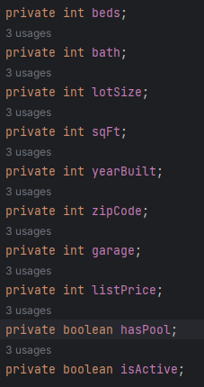
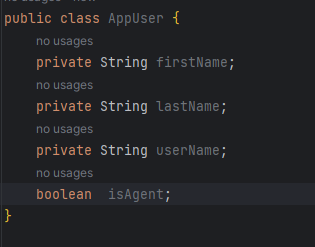

# Relational Database

## Authors: Cameron, DaJon, Stephen, Andrew & Chris

## Project Desription

- Relational Database focused on realty from a brokerage perspective of one-to-many and many-to-many with features within the listings. Focused on created authorization to specific features within the front-end for specific users.
```java 
@OneToMany
```
- Brokerage to Agents
- Agent to clients
- Agent to listings
- Property to property features

```java
@ManyToMany
```
- Agents to properties (multiple agentscan represent multiple listings)
- Features to properties (many properties can have similar features OR duplex and triplex can have many features)
- Listings to clients

## Wireframing

[Wireframes](./wireframes)

## Database Schema






## Domain Modeling 


## References

