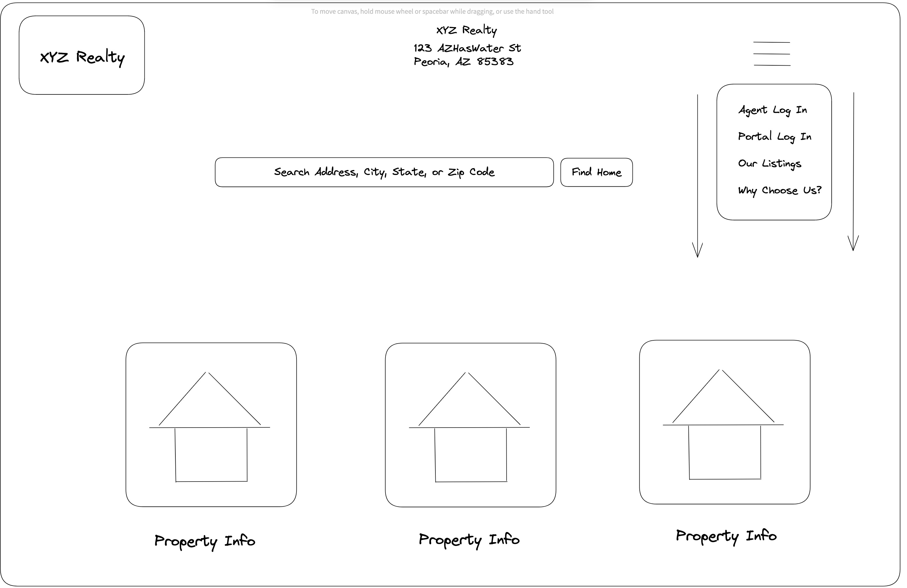

# Relational Database

## Authors: Cameron, DaJon, Stephen, Andrew & Chris

## Project Desription

- Relational Database focused on realty from a brokerage perspective of one-to-many and many-to-many with features within the listings. Focused on created authorization to specific features within the front-end for specific users.

## Wireframing

Brokerage branch -> Agents -> Listings -> Features -> Lot size, Square ft, Year built, Bedrooms & baths, Floors, Garage space, Carport space, Pool, Zip code, List price 

## Domain Modeling

## References

